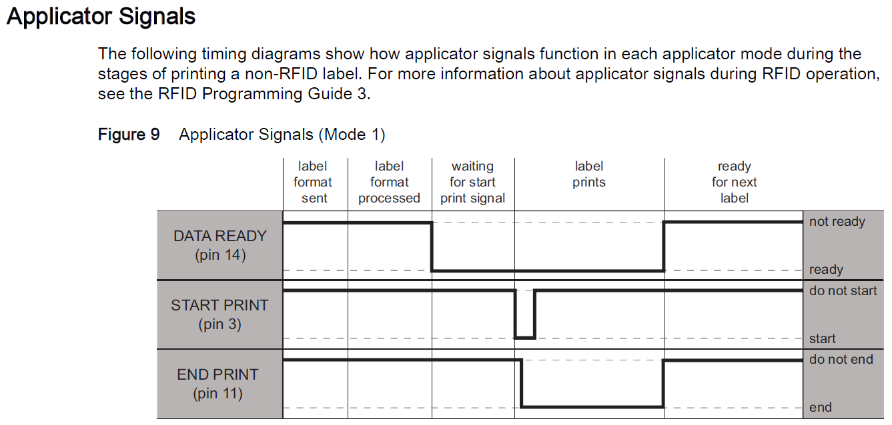

# Zebra-Printer-Link-OS_Understanding Logic of Applicator Port
# Applicator Portとはなにか？仕組みと活用場所を理解。

一部のテーブルトップはオートメーションデバイスとして動作できるようにアプリケータI/F オプションをご用意している。このようなオートメーション機器と連動ができるように特定のプリンタ機種にてアプリケータI/Fが実装可能となっている。プリンタのステータスをダイレクトに通知するためにレスポンス性が良い。このI/Fは自動処理システムなど、プリンタに対してシビアな制御が必要な運用環境下で用いられることが多い。

[Support Community: Applicator Interface Connector](https://support.zebra.com/cpws/docs/inquira/attachments/SO8455.pdf)

 

### 組み込みプリンタとは？（参考動画）

https://www.youtube.com/watch?v=mgz8I36TIg0
https://www.youtube.com/watch?v=4lKWtYnSpf0&pp=ygUWemVicmEgWkU1MTEgYXBwbGljYXRvcg%3D%3D
https://www.youtube.com/watch?v=DcbXBW2wPX0&pp=ygUMemVicmEgWkU1MTEg
https://www.youtube.com/watch?v=d1YKfU_zrK0
https://www.youtube.com/watch?v=mgz8I36TIg0

 

#### 利用可能プリンタ

- ZT400*
- ZT600*
- ZE500

\* 別途アプリケータインターフェイスオプションが必要。

 

#### Applicator シグナルパターン

例、Applicator シグナルパターン（Mode 1の場合）

[Data Connectors - Applicator Interface](./ZE511_Applicator.pdf)

